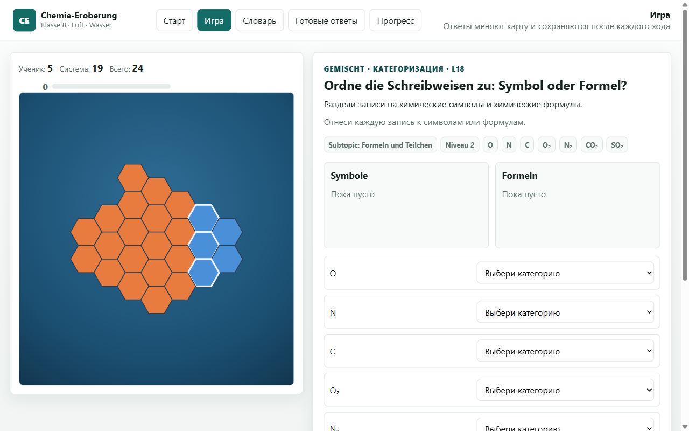

# Chemie-Eroberung

**[▶ Play in the browser](https://gluonmaster.github.io/chemie-eroberung/chemie-trainer/)**

A chemistry practice game for grade 8 that turns revision into a conquest: every correct answer captures a field on a hex map. It covers two topics of the Saxon Gymnasium curriculum, air as a mixture and water as a compound, and is made for Russian-speaking students who learn chemistry in German. Explanations are in Russian, while the chemistry terms and model answers stay German, so the school vocabulary sticks.



## Features

- 55 questions, 25 on air and 30 on water, in eight formats: single and multiple choice, true or false, matching, ordering, categorization, fill in the blank and short answers.
- A hex map whose size and starting territory you choose, with an optional soft or strict timer.
- Explanations after mistakes, a searchable German glossary and ready-made model answers.
- A mode that repeats earlier mistakes, and progress that is saved in the browser.

Short written answers are not graded automatically; the game shows the key terms and asks the student to compare their answer with the model answer.

## Running it locally

Open [chemie-trainer/index.html](chemie-trainer/index.html) in a browser. There is nothing to install or build, and no backend or API key. If you prefer a local server:

```sh
python -m http.server 8000 --bind 127.0.0.1
```

and open `http://127.0.0.1:8000/chemie-trainer/`.

## Source layout

| Path | Purpose |
| --- | --- |
| [chemie-trainer/index.html](chemie-trainer/index.html) | Entry point |
| [chemie-trainer/js/data.js](chemie-trainer/js/data.js) | Questions, glossary and model answers |
| [chemie-trainer/js/chemistry-engine.js](chemie-trainer/js/chemistry-engine.js) | Data validation, answer checking and question selection |
| [chemie-trainer/js/app.js](chemie-trainer/js/app.js) | Screens, exercise controls and game flow |
| `chemie-trainer/js/map-*.js` | Random hex map and its SVG rendering |
| [chemie-trainer/js/storage.js](chemie-trainer/js/storage.js) | Settings, current game and progress in the browser |
| [chemie-trainer/js/timer.js](chemie-trainer/js/timer.js) | Exercise timer |
| `chemie_klasse8_*_fragen.md` | The question banks as editable teaching material |

Nothing leaves the browser: settings, the current game and progress live in `localStorage` and are not synced between devices. If storage is blocked, the game keeps its state only while the tab is open.

The chemistry engine has a self-check for the question data and answer normalization. Open the game and run this in the browser console:

```js
ChemistryEngine.runSelfCheck(window.CHEMIE_DATA, { log: true })
```

## Credits and license

Made by Dr. Konstantin S. Shakun with the help of AI coding agents. The code is available under the [MIT License](LICENSE).
